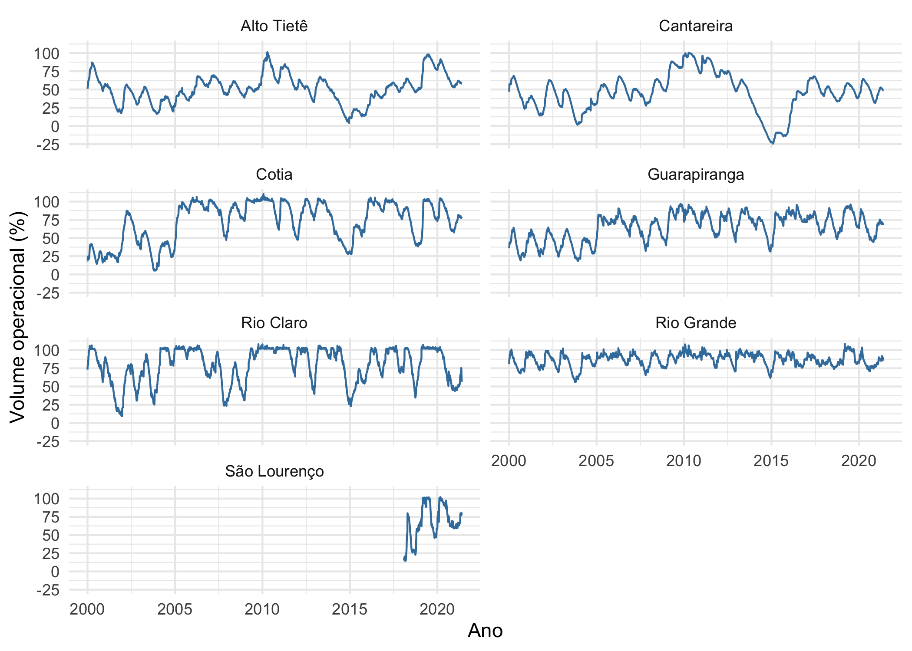

<!-- README.md is generated from README.Rmd. Please edit that file -->

# Share Your Data and Code 

Palestra: Coleta de dados automatizada e integração contínua utilizando
GitHub Actions: Exemplos com o Pacote Mananciais

Por: [Beatriz Milz](https://beatrizmilz.com/)

### Links úteis

-   [Slides](https://beatrizmilz.github.io/2021-SER/)
-   [Slides em
    PDF](https://github.com/eventoseroficial/Data_and_Code/blob/main/Beatriz%20Milz/slides.pdf)
-   [Pacote
    mananciais](https://beatrizmilz.github.io/mananciais/index.html)
-   [Exemplo de base de
    dados](https://github.com/eventoseroficial/Data_and_Code/blob/main/Beatriz%20Milz/dados_exemplo_mananciais.Rds) -
    gerado no código abaixo!

### Exemplo de uso do pacote

``` r
# Instalar o pacote
# install.packages("devtools")
# devtools::install_github("beatrizmilz/mananciais")


# Buscando os dados no pacote
mananciais <- mananciais::dados_mananciais() 

# Exportando os dados para que fiquem disponíveis neste repositório

readr::write_rds(mananciais, file = "dados_exemplo_mananciais.Rds")


# Criando visualizações com os dados

library(magrittr, include.only = "%>%")
mananciais %>% 
  ggplot2::ggplot() +
  ggplot2::geom_line(ggplot2::aes(x = data, y = volume_porcentagem), color = "#3e7dab") +
  ggplot2::scale_y_continuous(breaks = c(-25, 0, 25, 50, 75, 100)) +
  ggplot2::facet_wrap(~ sistema, ncol = 2) +
  ggplot2::theme_minimal() +
  ggplot2::labs(x = "Ano", y = "Volume operacional (%)") 
```

<!-- -->

### Resumo

O GitHub Actions [GHA](https://docs.github.com/pt/actions) permite
automatizar fluxos de trabalho de desenvolvimento de pacotes em R. Nessa
palestra, será mostrado alguns exemplos de uso de GitHub Actions no
pacote Mananciais, que disponibiliza dados sobre o volume operacional em
reservatórios utilizados para abastecimento público na Região
Metropolitana de São Paulo. Os exemplos que utilizam GHA são:
atualização da base de dados, checagem do pacote, execução de testes e
avaliação da cobertura de testes. O pacote foi desenvolvido por Beatriz
Milz, e pode ser acessado em:
<https://beatrizmilz.github.io/mananciais/index.html> . Este pacote foi
pensado para atender demandas de pessoas pesquisadoras que não somente
utilizam R, disponibilizando também a base de dados atualizada
diariamente em csv e em xlsx.

-   [Apresentações passadas disponíveis neste
    link](https://beatrizmilz.com/apresentacoes.html).
