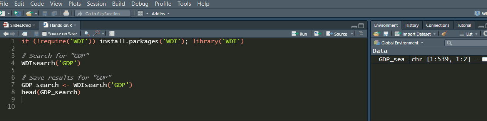

```{r metathis, echo=FALSE}
library(metathis)
meta() %>%
  meta_name("github-repo" = "bttomio/WDI---2021-Talk") %>% 
  meta_social(
    title = "Collect and use open access World Bank data to know your country",
    description = paste0(
      "Introduction to the R package WDI."
    ),
    url = "https://bttomio.github.io/slides/WDI---2021-Talk/Slides.html",
    image = "https://bttomio.github.io/slides/WDI---2021-Talk/share-card.png",
    image_alt = paste0(
      "Collect and use open access World Bank data to know your country,", 
      "presented by Bruno Thiago Tomio"
    ),
    og_type = "website",
    og_author = "Bruno Thiago Tomio",
    twitter_card_type = "summary_large_image",
    twitter_creator = "@bttomio",
  )
```

```{r setup, include=FALSE}
options(htmltools.dir.version = FALSE)
library(WDI)
library(dplyr)
library(rnaturalearth)
library(tidyverse)
library(ggplot2)
library(ggthemes)
library(ggrepel)
library(icons)
#remotes::install_github("mitchelloharawild/icons")
library(transformr)
library(gganimate)
#devtools::install_github("gadenbuie/xaringanExtra")
```

```{r xaringan-themer, include=FALSE, warning=FALSE}
library(xaringanthemer)
style_mono_light(
  header_font_google = google_font("Josefin Slab", "600"),
  text_font_google   = google_font("Work Sans", "300", "300i"),
  code_font_google   = google_font("IBM Plex Mono"),
  title_slide_background_image = "all-ok.PNG",
  title_slide_background_size = "95%",
  title_slide_background_position = "bottom",
  base_color = "#000000",
  code_inline_color = "#13A10E",
  link_color = "#13A10E",
  code_font_size = "0.7em"
)
```

```{r xaringanExtra-clipboard, echo=FALSE}
xaringanExtra::use_clipboard()
```

```{r xaringanExtra-share-again, echo=FALSE}
xaringanExtra::use_share_again()
```

```{r xaringan-panelset, echo=FALSE}
xaringanExtra::use_panelset()
```

count: false

class: inverse, center, title-slide, middle

<style>
.title-slide .remark-slide-number {
  display: none;
}
</style>

# Collect and use open access World Bank data to know your country

### [`Bruno Thiago Tomio`](https://bttomio.github.io)

<a href="https://github.com/bttomio" class="github-corner" aria-label="View source on Github"><svg width="80" height="80" viewBox="0 0 250 250" style="fill:#fff; color:#151513; position: absolute; top: 0; border: 0; right: 0;" aria-hidden="true"><path d="M0,0 L115,115 L130,115 L142,142 L250,250 L250,0 Z"></path><path d="M128.3,109.0 C113.8,99.7 119.0,89.6 119.0,89.6 C122.0,82.7 120.5,78.6 120.5,78.6 C119.2,72.0 123.4,76.3 123.4,76.3 C127.3,80.9 125.5,87.3 125.5,87.3 C122.9,97.6 130.6,101.9 134.4,103.2" fill="currentColor" style="transform-origin: 130px 106px;" class="octo-arm"></path><path d="M115.0,115.0 C114.9,115.1 118.7,116.5 119.8,115.4 L133.7,101.6 C136.9,99.2 139.9,98.4 142.2,98.6 C133.8,88.0 127.5,74.4 143.8,58.0 C148.5,53.4 154.0,51.2 159.7,51.0 C160.3,49.4 163.2,43.6 171.4,40.1 C171.4,40.1 176.1,42.5 178.8,56.2 C183.1,58.6 187.2,61.8 190.9,65.4 C194.5,69.0 197.7,73.2 200.1,77.6 C213.8,80.2 216.3,84.9 216.3,84.9 C212.7,93.1 206.9,96.0 205.4,96.6 C205.1,102.4 203.0,107.8 198.3,112.5 C181.9,128.9 168.3,122.5 157.7,114.1 C157.9,116.9 156.7,120.9 152.7,124.9 L141.0,136.5 C139.8,137.7 141.6,141.9 141.8,141.8 Z" fill="currentColor" class="octo-body"></path></svg></a><style>.github-corner:hover .octo-arm{animation:octocat-wave 560ms ease-in-out}@keyframes octocat-wave{0%,100%{transform:rotate(0)}20%,60%{transform:rotate(-25deg)}40%,80%{transform:rotate(10deg)}}@media (max-width:500px){.github-corner:hover .octo-arm{animation:none}.github-corner .octo-arm{animation:octocat-wave 560ms ease-in-out}}</style>

<a href="https://github.com/bttomio/WDI---2021-Talk"></a>

---

count: false

class: inverse, center, middle

# General view

---

# World Bank data in `r icons::fontawesome$brands$"r-project"`

The `WDI` package allows us to search and download data from the World Bank (several datasets, with thousands of variables)

--

**Advantages**

- Reproducible research

--

- Annual, quarterly, and monthly data in long format

--

- Collect, plot, analyse, and estimate econometric models in the same free software

--

**Important links**

- Package website, developed by [Vincent Arel-Bundock](vincent.arel-bundock@umontreal.ca) </br> [https://vincentarelbundock.github.io/WDI/index.html](https://vincentarelbundock.github.io/WDI/index.html)

--

- DataBank, to check variables details </br> [https://databank.worldbank.org/](https://databank.worldbank.org/)

--

- `wbstats` (alternative package) </br> [http://nset-ornl.github.io/wbstats/index.html](http://nset-ornl.github.io/wbstats/index.html)

---

count: false

class: inverse, center, middle

# Hands-on

Based on the package website </br> https://vincentarelbundock.github.io/WDI/index.html

---

**Installation**

```{r eval=FALSE}
install.packages('WDI')
```

--

**Searching for data**

You need to use **keywords** to search for data with the command `WDIsearch`

```{r eval=FALSE}
# Search for 'GDP'
WDIsearch('GDP')
```

--

You can create an object in the global environment to easily navigate all the variables with the keyword

```{r}
# Save results for 'GDP'
GDP_search <- WDIsearch('GDP')
```


---

**Collect data**

*GDP per capita for France (FR) and Brazil (BR)*

```{r}
# indicator = NY.GDP.PCAP.KD / name = GDP per capita (constant 2010 US$)
indicator <- c("GDP per capita" = 'NY.GDP.PCAP.KD')
dat1 <- WDI(indicator, country=c('FR', 'BR'), end = 2019)
head(dat1)
```

*GDP per capita (US$ and local currency unity) for France (FR) and Brazil (BR)*

```{r}
# indicators = NY.GDP.PCAP.KD and NY.GDP.PCAP.KN / names = GDP per capita (constant 2010 US$) 
# and GDP per capita (constant LCU)
indicators <- c("GDP per capita (US$)" = 'NY.GDP.PCAP.KD', 
                "GDP per capita (LCU)" = "NY.GDP.PCAP.KN")
dat2 <- WDI(indicators, country=c('FR', 'BR'), end = 2019)
head(dat2)
```

---

**Plot data (1/2)**

```{r, fig.width=10, fig.height=5, fig.align='center'} 
library(ggplot2)
# GDP per capita for France and Brazil
ggplot(dat1, aes(year, `GDP per capita`, color=country)) + geom_line() +
    xlab('Year') + ylab('GDP per capita')
```

---

**Plot data (2/2)**

```{r, fig.width=10, fig.height=5, fig.align='center'} 
# GDP per capita (US$ and local currency unity) for France and Brazil
library(ggthemes) #<<
ggplot(dat2, aes(year, color=country)) + 
  geom_line(aes(year, `GDP per capita (US$)`)) + #<<
  geom_line(aes(year, `GDP per capita (LCU)`), linetype = "dashed") + #<<
  xlab('Year') + ylab('GDP per capita') +
  labs(caption = "GDP per capita (US$), solid; GDP per capita (LCU), dashed") + #<<
  theme_economist() + #<<
  scale_colour_economist() #<<
```

---

**More details on the indicators**

```{r, eval=FALSE}
library(dplyr)
Data_info <- WDI_data
Data_series <- as.data.frame(Data_info$series) %>%
  filter(indicator == "NY.GDP.PCAP.KD")
colnames(Data_series)
```

```{r, echo=FALSE}
library(dplyr)
Data_info <- WDI_data
Data_series <- as.data.frame(Data_info$series) %>%
  filter(indicator == "NY.GDP.PCAP.KD")
colnames(Data_series)
```

```{r, eval=FALSE}
Data_series$description
```

```{r, echo=FALSE, results='asis'}
library(dplyr)
Data_info <- WDI_data
Data_series <- as.data.frame(Data_info$series) %>%
  filter(indicator == "NY.GDP.PCAP.KD")
Data_series$description
```

---

**More details on the geographical selection**

```{r t1, warning=FALSE, message=FALSE}
library(knitr)
library(kableExtra)
Data_countries <- as.data.frame(Data_info$country) 
Data_countries %>%
  kable("html") %>%
  kable_styling(font_size = 11) %>%
  scroll_box(width = "100%", height = "60%")
```

---

**Plot data for several countries (1/2)**

```{r, eval=FALSE}
# indicator = NY.GDP.PCAP.KD / name = GDP per capita (constant 2010 US$)
indicator <- c("GDP per capita" = 'IT.NET.USER.ZS')
datall <- WDI(indicator, country="all", end = 2019)

LATAM <- Data_info$country %>%
  data.frame() %>%
  filter(region == "Latin America & Caribbean") %>%
  select(country) %>%
  unlist()

datall %>%
  filter(country %in% LATAM) %>%
  ggplot(aes(year, `GDP per capita`)) + geom_line() +
  facet_wrap(vars(country), scales = "free_y")
```

---

**Plot data for several countries (2/2)**

```{r, echo=FALSE, warning=FALSE, fig.width=15, fig.height=10, fig.align='center'}
# indicator = NY.GDP.PCAP.KD / name = GDP per capita (constant 2010 US$)
indicator <- c("GDP per capita" = 'IT.NET.USER.ZS')
datall <- WDI(indicator, country="all", end = 2019)

LATAM <- Data_info$country %>%
  data.frame() %>%
  filter(region == "Latin America & Caribbean") %>%
  select(country) %>%
  unlist()

datall %>%
  filter(country %in% LATAM) %>%
  ggplot(aes(year, `GDP per capita`)) + geom_line() +
  facet_wrap(vars(country), scales = "free_y")
```

---

count: false

class: inverse, center, middle

# Some cool graphs

Based on the `wbstats` website </br> http://nset-ornl.github.io/wbstats/index.html

<br>

```{css, echo = FALSE}
.verytiny {
  font-size: 50%;
}
```

 <br> .verytiny[Source <br> https://damassets.autodesk.net/content/dam/autodesk/www/autodesk-reasearch/Publications/images/same-stats-different-graphs-image-1920x1000.gif]

---

**World maps (1/3)** &#127758;

.panelset[
.panel[.panel-name[Code Map 1]
```{r eval=FALSE}
library(rnaturalearth)
library(tidyverse)

# Self-employed in 2019
indicator <- c("Self-employed" = 'SL.EMP.SELF.ZS')
datWM1 <- WDI(indicator, country="all", start = 2019, end = 2019)

Data_info <- WDI_data

name_self_employed <- as.data.frame(Data_info$series) %>%
  filter(indicator == "SL.EMP.SELF.ZS") %>%
  select(name)

source_self_employed <- as.data.frame(Data_info$series) %>%
  filter(indicator == "SL.EMP.SELF.ZS") %>%
  select(sourceOrganization)

ne_countries(returnclass = "sf") %>%
  left_join(datWM1, c("iso_a2" = "iso2c")) %>%
  filter(iso_a2 != "ATA") %>% # remove Antarctica
  ggplot(aes(fill = `Self-employed`)) +
  geom_sf() +
  scale_fill_viridis_c(labels = scales::percent_format(scale = 1)) +
  theme(legend.position="bottom") +
  labs(
    title = paste0(name_self_employed, " in 2019"),
    fill = NULL,
    caption = paste0("Source:", source_self_employed) 
  )
```
]
.panel[.panel-name[Plot 1]
```{r, fig.width=11, fig.height=7, fig.align='center', echo=FALSE, warning=FALSE, message=FALSE}
# Self-employed in 2019
indicator <- c("Self-employed" = 'SL.EMP.SELF.ZS')
datWM1 <- WDI(indicator, country="all", start = 2019, end = 2019)

Data_info <- WDI_data

name_self_employed <- as.data.frame(Data_info$series) %>%
  filter(indicator == "SL.EMP.SELF.ZS") %>%
  select(name)

source_self_employed <- as.data.frame(Data_info$series) %>%
  filter(indicator == "SL.EMP.SELF.ZS") %>%
  select(sourceOrganization)

ne_countries(returnclass = "sf") %>%
  left_join(datWM1, c("iso_a2" = "iso2c")) %>%
  filter(iso_a2 != "ATA") %>% # remove Antarctica
  ggplot(aes(fill = `Self-employed`)) +
  geom_sf() +
  scale_fill_viridis_c(labels = scales::percent_format(scale = 1)) +
  theme(legend.position="bottom") +
  labs(
    title = paste0(name_self_employed, " in 2019"),
    fill = NULL,
    caption = paste0("Source:", source_self_employed) 
  )
```
]
.panel[.panel-name[Code Map 2]
```{r eval=FALSE}
# Self-employed in 2008
indicator <- c("Self-employed" = 'SL.EMP.SELF.ZS')
datWM2 <- WDI(indicator, country="all", start = 2008, end = 2008) #<<

name_self_employed <- as.data.frame(Data_info$series) %>%
  filter(indicator == "SL.EMP.SELF.ZS") %>%
  select(name)

source_self_employed <- as.data.frame(Data_info$series) %>%
  filter(indicator == "SL.EMP.SELF.ZS") %>%
  select(sourceOrganization)

ne_countries(returnclass = "sf") %>%
  left_join(datWM2, c("iso_a2" = "iso2c")) %>% #<<
  filter(iso_a2 != "ATA") %>% # remove Antarctica
  ggplot(aes(fill = `Self-employed`)) +
  geom_sf() +
  scale_fill_viridis_c(labels = scales::percent_format(scale = 1)) +
  theme(legend.position="bottom") +
  labs(
    title = paste0(name_self_employed, " in 2008"), #<<
    fill = NULL,
    caption = paste0("Source:", source_self_employed) 
  )
```
]
.panel[.panel-name[Plot 2]
```{r, fig.width=11, fig.height=7, fig.align='center', echo=FALSE, warning=FALSE, message=FALSE}
# Self-employed in 2008
indicator <- c("Self-employed" = 'SL.EMP.SELF.ZS')
datWM2 <- WDI(indicator, country="all", start = 2008, end = 2008)

Data_info <- WDI_data

name_self_employed <- as.data.frame(Data_info$series) %>%
  filter(indicator == "SL.EMP.SELF.ZS") %>%
  select(name)

source_self_employed <- as.data.frame(Data_info$series) %>%
  filter(indicator == "SL.EMP.SELF.ZS") %>%
  select(sourceOrganization)

ne_countries(returnclass = "sf") %>%
  left_join(datWM2, c("iso_a2" = "iso2c")) %>%
  filter(iso_a2 != "ATA") %>% # remove Antarctica
  ggplot(aes(fill = `Self-employed`)) +
  geom_sf() +
  scale_fill_viridis_c(labels = scales::percent_format(scale = 1)) +
  theme(legend.position="bottom") +
  labs(
    title = paste0(name_self_employed, " in 2008"),
    fill = NULL,
    caption = paste0("Source:", source_self_employed) 
  )
```
]
.panel[.panel-name[Code Map 3]
```{r eval=FALSE}
# Self-employed in 1991
indicator <- c("Self-employed" = 'SL.EMP.SELF.ZS')
datWM3 <- WDI(indicator, country="all", start = 1991, end = 1991) #<<

name_self_employed <- as.data.frame(Data_info$series) %>%
  filter(indicator == "SL.EMP.SELF.ZS") %>%
  select(name)

source_self_employed <- as.data.frame(Data_info$series) %>%
  filter(indicator == "SL.EMP.SELF.ZS") %>%
  select(sourceOrganization)

ne_countries(returnclass = "sf") %>%
  left_join(datWM3, c("iso_a2" = "iso2c")) %>% #<<
  filter(iso_a2 != "ATA") %>% # remove Antarctica
  ggplot(aes(fill = `Self-employed`)) +
  geom_sf() +
  scale_fill_viridis_c(labels = scales::percent_format(scale = 1)) +
  theme(legend.position="bottom") +
  labs(
    title = paste0(name_self_employed, " in 1991"), #<<
    fill = NULL,
    caption = paste0("Source:", source_self_employed) 
  )
```
]
.panel[.panel-name[Plot 3]
```{r, fig.width=11, fig.height=7, fig.align='center', echo=FALSE, warning=FALSE, message=FALSE}
# Self-employed in 1991
indicator <- c("Self-employed" = 'SL.EMP.SELF.ZS')
datWM3 <- WDI(indicator, country="all", start = 1991, end = 1991)

Data_info <- WDI_data

name_self_employed <- as.data.frame(Data_info$series) %>%
  filter(indicator == "SL.EMP.SELF.ZS") %>%
  select(name)

source_self_employed <- as.data.frame(Data_info$series) %>%
  filter(indicator == "SL.EMP.SELF.ZS") %>%
  select(sourceOrganization)

ne_countries(returnclass = "sf") %>%
  left_join(datWM3, c("iso_a2" = "iso2c")) %>%
  filter(iso_a2 != "ATA") %>% # remove Antarctica
  ggplot(aes(fill = `Self-employed`)) +
  geom_sf() +
  scale_fill_viridis_c(labels = scales::percent_format(scale = 1)) +
  theme(legend.position="bottom") +
  labs(
    title = paste0(name_self_employed, " in 1991"),
    fill = NULL,
    caption = paste0("Source:", source_self_employed) 
  )
```
]
]

---

**World maps (2/3)** &#127757;

.panelset[
.panel[.panel-name[Code Map 4]
```{r eval=FALSE}
# GDP per capita (constant 2010 US$) in 2019
indicator <- c("GDP per capita" = 'NY.GDP.PCAP.KD') #<<
datWM4 <- WDI(indicator, country="all", start = 2019, end = 2019) #<<

Data_info <- WDI_data

name_GDP_PC <- as.data.frame(Data_info$series) %>% #<<
  filter(indicator == "NY.GDP.PCAP.KD") %>% #<<
  select(name)

source_GDP_PC <- as.data.frame(Data_info$series) %>% #<<
  filter(indicator == "NY.GDP.PCAP.KD") %>% #<<
  select(sourceOrganization) 

ne_countries(returnclass = "sf") %>%
  left_join(datWM4, c("iso_a2" = "iso2c")) %>% #<<
  filter(iso_a2 != "ATA") %>% # remove Antarctica
  ggplot(aes(fill = `GDP per capita`)) + #<<
  geom_sf() +
  scale_fill_viridis_c(labels = scales::dollar_format(scale = 1)) + #<<
  theme(legend.position="bottom", legend.key.width = unit(2.5, "cm")) + #<<
  labs(
    title = paste0(name_GDP_PC, " in 2019"), #<<
    fill = NULL,
    caption = paste0("Source:", source_GDP_PC) #<<
  )
```
]
.panel[.panel-name[Plot 4]
```{r, fig.width=11, fig.height=7, fig.align='center', echo=FALSE, warning=FALSE, message=FALSE}
# GDP per capita (constant 2010 US$) in 2019
indicator <- c("GDP per capita" = 'NY.GDP.PCAP.KD')
datWM4 <- WDI(indicator, country="all", start = 2019, end = 2019)

Data_info <- WDI_data

name_GDP_PC <- as.data.frame(Data_info$series) %>%
  filter(indicator == "NY.GDP.PCAP.KD") %>%
  select(name)

source_GDP_PC <- as.data.frame(Data_info$series) %>%
  filter(indicator == "NY.GDP.PCAP.KD") %>%
  select(sourceOrganization) 

ne_countries(returnclass = "sf") %>%
  left_join(datWM4, c("iso_a2" = "iso2c")) %>%
  filter(iso_a2 != "ATA") %>% # remove Antarctica
  ggplot(aes(fill = `GDP per capita`)) +
  geom_sf() +
  scale_fill_viridis_c(labels = scales::dollar_format(scale = 1)) +
  theme(legend.position="bottom", legend.key.width = unit(2.5, "cm")) +
  labs(
    title = paste0(name_GDP_PC, " in 2019"),
    fill = NULL,
    caption = paste0("Source:", source_GDP_PC)
  )
```
]
.panel[.panel-name[Code Map 5]
```{r eval=FALSE}
# Unemployment rate,Percent,,, in February 2020
indicator <- c("Unemployment" = 'UNEMPSA_') #<<
datWM5 <- WDI(indicator, country="all",start = '2020M02', end = '2020M02') #<<

name_UNEMP <- as.data.frame(Data_info$series) %>% #<<
  filter(indicator == "UNEMPSA_") %>% #<<
  select(name)

ne_countries(returnclass = "sf") %>%
  left_join(datWM5, c("iso_a3" = "iso2c")) %>% #<<
  filter(iso_a2 != "ATA") %>% # remove Antarctica
  ggplot(aes(fill = `Unemployment`)) + #<<
  geom_sf() +
  scale_fill_viridis_c(labels = scales::percent_format(scale = 1)) + #<<
  theme(legend.position="bottom") +
  labs(
    title = paste0(name_UNEMP, " in February 2020"), #<<
    fill = NULL,
    caption = "Source: Global Economic Monitor, World Bank" #<<
  )
```
]
.panel[.panel-name[Plot 5]
```{r, fig.width=11, fig.height=7, fig.align='center', echo=FALSE, warning=FALSE, message=FALSE}
# Unemployment rate,Percent,,, in February 2020
indicator <- c("Unemployment" = 'UNEMPSA_')
datWM5 <- WDI(indicator, country="all",start = '2020M02', end = '2020M02') #<<

Data_info <- WDI_data

name_UNEMP <- as.data.frame(Data_info$series) %>%
  filter(indicator == "UNEMPSA_") %>%
  select(name)

ne_countries(returnclass = "sf") %>%
  left_join(datWM5, c("iso_a3" = "iso2c")) %>%
  filter(iso_a2 != "ATA") %>% # remove Antarctica
  ggplot(aes(fill = `Unemployment`)) +
  geom_sf() +
  scale_fill_viridis_c(labels = scales::percent_format(scale = 1)) +
  theme(legend.position="bottom") +
  labs(
    title = paste0(name_UNEMP, " in February 2020"),
    fill = NULL,
    caption = "Source: Global Economic Monitor, World Bank" 
  )
```
]
.panel[.panel-name[Code Map 6]
```{r eval=FALSE}
# Life expectancy at birth, female (years) in 2018
indicator <- c("Life expectancy at birth, female (years)" = 'SP.DYN.LE00.FE.IN') #<<
datWM6 <- WDI(indicator, country="all",start = '2018', end = '2018') #<<

Data_info <- WDI_data

name_life <- as.data.frame(Data_info$series) %>% #<<
  filter(indicator == "SP.DYN.LE00.FE.IN") %>% #<<
  select(name)

source_life <- as.data.frame(Data_info$series) %>% #<<
  filter(indicator == "SP.DYN.LE00.FE.IN") %>% #<<
  select(sourceOrganization)

ne_countries(returnclass = "sf") %>%
  left_join(datWM6, c("iso_a2" = "iso2c")) %>% #<<
  filter(iso_a2 != "ATA") %>% # remove Antarctica
  ggplot(aes(fill = `Life expectancy at birth, female (years)`)) + #<<
  geom_sf() +
  scale_fill_viridis_c(labels = scales::number_format(scale = 1)) + #<<
  theme(legend.position="bottom") +
  labs(
    title = paste0(name_life, " in 2018"), #<<
    fill = NULL,
    caption = paste0("Source:", source_life)  #<<
  )
```
]
.panel[.panel-name[Plot 6]
```{r, fig.width=11, fig.height=7, fig.align='center', echo=FALSE, warning=FALSE, message=FALSE}
# Life expectancy at birth, female (years) in 2018
indicator <- c("Life expectancy at birth, female (years)" = 'SP.DYN.LE00.FE.IN')
datWM6 <- WDI(indicator, country="all",start = '2018', end = '2018')

Data_info <- WDI_data

name_life <- as.data.frame(Data_info$series) %>%
  filter(indicator == "SP.DYN.LE00.FE.IN") %>%
  select(name)

source_life <- as.data.frame(Data_info$series) %>%
  filter(indicator == "SP.DYN.LE00.FE.IN") %>%
  select(sourceOrganization)

ne_countries(returnclass = "sf") %>%
  left_join(datWM6, c("iso_a2" = "iso2c")) %>%
  filter(iso_a2 != "ATA") %>% # remove Antarctica
  ggplot(aes(fill = `Life expectancy at birth, female (years)`)) +
  geom_sf() +
  scale_fill_viridis_c(labels = scales::number_format(scale = 1)) +
  theme(legend.position="bottom") +
  labs(
    title = paste0(name_life, " in 2018"),
    fill = NULL,
    caption = paste0("Source:", source_life) 
  )
```
]
]

---

**World maps (3/3)** &#127759;

.panelset[
.panel[.panel-name[Code Map 7]
```{r eval=FALSE}
library(gganimate) #<<

# Self-employed, 1970-2019
indicator <- c("Self-employed" = 'SL.EMP.SELF.ZS')
datWM7 <- WDI(indicator, country="all", start = 1990, end = 2019) #<<

name_self_employed <- as.data.frame(Data_info$series) %>%
  filter(indicator == "SL.EMP.SELF.ZS") %>%
  select(name)

source_self_employed <- as.data.frame(Data_info$series) %>%
  filter(indicator == "SL.EMP.SELF.ZS") %>%
  select(sourceOrganization)

ne_countries(returnclass = "sf") %>%
  left_join(datWM7, c("iso_a2" = "iso2c")) %>% #<<
  filter(iso_a2 != "ATA") %>% # remove Antarctica
  ggplot(aes(fill = `Self-employed`)) +
  geom_sf() +
  scale_fill_viridis_c(labels = scales::percent_format(scale = 1)) +
  theme(legend.position="bottom") +
  labs(
    title = paste0(name_self_employed, " in {closest_state}"), #<<
    fill = NULL,
    caption = paste0("Source:", source_self_employed)) + 
  transition_states(year, transition_length = 3, state_length = 1) #<<
```
]
.panel[.panel-name[Plot 7]
```{r, fig.width=11, fig.height=7, fig.align='center', echo=FALSE, warning=FALSE, message=FALSE}
# Self-employed, 1970-2019
indicator <- c("Self-employed" = 'SL.EMP.SELF.ZS')
datWM7 <- WDI(indicator, country="all", start = 1990, end = 2019) #<<

name_self_employed <- as.data.frame(Data_info$series) %>%
  filter(indicator == "SL.EMP.SELF.ZS") %>%
  select(name)

source_self_employed <- as.data.frame(Data_info$series) %>%
  filter(indicator == "SL.EMP.SELF.ZS") %>%
  select(sourceOrganization)

ne_countries(returnclass = "sf") %>%
  left_join(datWM7, c("iso_a2" = "iso2c")) %>% #<<
  filter(iso_a2 != "ATA") %>% # remove Antarctica
  ggplot(aes(fill = `Self-employed`)) +
  geom_sf() +
  scale_fill_viridis_c(labels = scales::percent_format(scale = 1)) +
  theme(legend.position="bottom") +
  labs(
    title = paste0(name_self_employed, " in {closest_state}"), #<<
    fill = NULL,
    caption = paste0("Source:", source_self_employed)) + 
  transition_states(year, transition_length = 3, state_length = 1)
#Packages png and gifski are needed
```
]
.panel[.panel-name[Code Map 8]
```{r eval=FALSE}
# GDP per capita (constant 2010 US$), 1970-2019
indicator <- c("GDP per capita" = 'NY.GDP.PCAP.KD') #<<
datWM7 <- WDI(indicator, country="all", start = 1970, end = 2019) #<<

name_GDP_PC <- as.data.frame(Data_info$series) %>% 
  filter(indicator == "NY.GDP.PCAP.KD") %>% 
  select(name)

source_GDP_PC <- as.data.frame(Data_info$series) %>% 
  filter(indicator == "NY.GDP.PCAP.KD") %>% 
  select(sourceOrganization) 

ne_countries(returnclass = "sf") %>%
  left_join(datWM7, c("iso_a2" = "iso2c")) %>% 
  filter(iso_a2 != "ATA") %>% # remove Antarctica
  ggplot(aes(fill = `GDP per capita`)) + 
  geom_sf() +
  scale_fill_viridis_c(labels = scales::dollar_format(scale = 1)) + 
  theme(legend.position="bottom", legend.key.width = unit(2.5, "cm")) + 
  labs(
    title = paste0(name_GDP_PC, " in {closest_state}"), #<<
    fill = NULL,
    caption = paste0("Source:", source_GDP_PC)) +
  transition_states(year, transition_length = 3, state_length = 1)
```
]
.panel[.panel-name[Plot 8]
```{r, fig.width=11, fig.height=7, fig.align='center', echo=FALSE, warning=FALSE, message=FALSE}
# GDP per capita (constant 2010 US$), 1970-2019
indicator <- c("GDP per capita" = 'NY.GDP.PCAP.KD') #<<
datWM8 <- WDI(indicator, country="all", start = 1970, end = 2019) #<<

name_GDP_PC <- as.data.frame(Data_info$series) %>% 
  filter(indicator == "NY.GDP.PCAP.KD") %>% 
  select(name)

source_GDP_PC <- as.data.frame(Data_info$series) %>% 
  filter(indicator == "NY.GDP.PCAP.KD") %>% 
  select(sourceOrganization) 

ne_countries(returnclass = "sf") %>%
  left_join(datWM8, c("iso_a2" = "iso2c")) %>% #<<
  filter(iso_a2 != "ATA") %>% # remove Antarctica
  ggplot(aes(fill = `GDP per capita`)) + 
  geom_sf() +
  scale_fill_viridis_c(labels = scales::dollar_format(scale = 1)) + 
  theme(legend.position="bottom", legend.key.width = unit(2.5, "cm")) + 
  labs(
    title = paste0(name_GDP_PC, " in {closest_state}"), #<<
    fill = NULL,
    caption = paste0("Source:", source_GDP_PC)) +
  transition_states(year, transition_length = 3, state_length = 1)
```
]
.panel[.panel-name[Code Map 9]
```{r eval=FALSE}
# Life expectancy at birth, female (years), 1970-2018
indicator <- c("Life expectancy at birth, female (years)" = 'SP.DYN.LE00.FE.IN')
datWM9 <- WDI(indicator, country="all",start = '1970', end = '2018') #<<

name_life <- as.data.frame(Data_info$series) %>%
  filter(indicator == "SP.DYN.LE00.FE.IN") %>%
  select(name)

source_life <- as.data.frame(Data_info$series) %>%
  filter(indicator == "SP.DYN.LE00.FE.IN") %>%
  select(sourceOrganization)

ne_countries(returnclass = "sf") %>%
  left_join(datWM9, c("iso_a2" = "iso2c")) %>% #<<
  filter(iso_a2 != "ATA") %>% # remove Antarctica
  ggplot(aes(fill = `Life expectancy at birth, female (years)`)) +
  geom_sf() +
  scale_fill_viridis_c(labels = scales::number_format(scale = 1)) +
  theme(legend.position="bottom") +
  labs(
    title = paste0(name_life, " in {closest_state}"), #<<
    fill = NULL,
    caption = paste0("Source:", source_life)
  ) +
  transition_states(year, transition_length = 3, state_length = 1) #<<
```
]
.panel[.panel-name[Plot 9]
```{r, fig.width=11, fig.height=7, fig.align='center', echo=FALSE, warning=FALSE, message=FALSE}
# Life expectancy at birth, female (years), 1970-2018
indicator <- c("Life expectancy at birth, female (years)" = 'SP.DYN.LE00.FE.IN')
datWM9 <- WDI(indicator, country="all",start = '1970', end = '2018')

name_life <- as.data.frame(Data_info$series) %>%
  filter(indicator == "SP.DYN.LE00.FE.IN") %>%
  select(name)

source_life <- as.data.frame(Data_info$series) %>%
  filter(indicator == "SP.DYN.LE00.FE.IN") %>%
  select(sourceOrganization)

ne_countries(returnclass = "sf") %>%
  left_join(datWM9, c("iso_a2" = "iso2c")) %>%
  filter(iso_a2 != "ATA") %>% # remove Antarctica
  ggplot(aes(fill = `Life expectancy at birth, female (years)`)) +
  geom_sf() +
  scale_fill_viridis_c(labels = scales::number_format(scale = 1)) +
  theme(legend.position="bottom") +
  labs(
    title = paste0(name_life, " in {closest_state}"),
    fill = NULL,
    caption = paste0("Source:", source_life)
  ) +
  transition_states(year, transition_length = 3, state_length = 1)
```
]
]

---

**Hans Rosling's Gapminder** &#127760;

.panelset[
.panel[.panel-name[Code HRG 1]
```{r eval=FALSE}
indicators <- c(life_exp = "SP.DYN.LE00.IN", 
                gdp_capita ="NY.GDP.PCAP.CD",
                pop = "SP.POP.TOTL")

hrg <- WDI(indicators, country="all", start = "2018", end = "2018")
Data_info <- WDI_data
Data_countries <- as.data.frame(Data_info$country) 

hrg %>%
  left_join(Data_countries, "iso2c") %>%
  filter(region != "Aggregates") %>% # remove aggregates (groups of countries)
  ggplot() +
  geom_point(aes(x = gdp_capita, y = life_exp, size = pop, color = region)) +
  scale_x_continuous(
    labels = scales::dollar_format(),
    breaks = scales::log_breaks(n = 10)) +
  coord_trans(x = 'log10') +
  scale_size_continuous(
    labels = scales::number_format(scale = 1/1e6, suffix = "m"),
    breaks = seq(1e8,1e9, 2e8),
    range = c(1,20)) +
  theme_minimal() +
  labs(title = "An Example of Hans Rosling's Gapminder using WDI (Data for 2018)",
    x = "GDP per capita (log scale)",
    y = "Life expectancy at birth",
    size = "Population",
    color = NULL,
    caption = "Source: World Bank")
```
]
.panel[.panel-name[Plot 1]
```{r, fig.width=11, fig.height=7, fig.align='center', echo=FALSE, warning=FALSE, message=FALSE}
indicators <- c(life_exp = "SP.DYN.LE00.IN", 
                gdp_capita ="NY.GDP.PCAP.CD",
                pop = "SP.POP.TOTL")

hrg <- WDI(indicators, country="all", start = "2018", end = "2018")
Data_info <- WDI_data
Data_countries <- as.data.frame(Data_info$country) 

hrg %>%
  left_join(Data_countries, "iso2c") %>%
  filter(region != "Aggregates") %>% # remove aggregates (groups of countries)
  ggplot() +
  geom_point(aes(x = gdp_capita, y = life_exp, size = pop, color = region)) +
  scale_x_continuous(
    labels = scales::dollar_format(),
    breaks = scales::log_breaks(n = 10)) +
  coord_trans(x = 'log10') +
  scale_size_continuous(
    labels = scales::number_format(scale = 1/1e6, suffix = "m"),
    breaks = seq(1e8,1e9, 2e8),
    range = c(1,20)) +
  theme_minimal() +
  labs(
    title = "An Example of Hans Rosling's Gapminder using WDI (Data for 2018)",
    x = "GDP per capita (log scale)",
    y = "Life expectancy at birth",
    size = "Population",
    color = NULL,
    caption = "Source: World Bank")
```
]
.panel[.panel-name[Code HRG 2]
```{r eval=FALSE}
library(ggrepel) #<<

hrg2 <- hrg %>% #<<
  left_join(Data_countries, "iso2c") %>% #<<
  filter(region != "Aggregates") # remove aggregates (groups of countries) #<<

ggplot(hrg2) + #<<
  geom_point(
    aes(x = gdp_capita, y = life_exp, size = pop, color = region)) +
  scale_x_continuous(
    labels = scales::dollar_format(),
    breaks = scales::log_breaks(n = 10)) +
  coord_trans(x = 'log10') +
  scale_size_continuous(
    labels = scales::number_format(scale = 1/1e6, suffix = "m"),
    breaks = seq(1e8,1e9, 2e8),
    range = c(1,20)) +
  theme_minimal() +
  labs(x = "GDP per capita (log scale)",
    y = "Life expectancy at birth",
    size = "Population",
    color = NULL,
    caption = "Source: World Bank") +
  geom_label_repel(data = subset(hrg2, life_exp > 84 | life_exp < 55), #<<
                   aes(x = gdp_capita, y = life_exp, label = country.x), #<<
                   box.padding   = 0.35,  #<<
                   point.padding = 0.5, #<<
                   segment.color = 'grey50') #<<
```
]
.panel[.panel-name[Plot 2]
```{r, fig.width=11, fig.height=7, fig.align='center', echo=FALSE, warning=FALSE, message=FALSE}
hrg2 <- hrg %>%
  left_join(Data_countries, "iso2c") %>%
  filter(region != "Aggregates") # remove aggregates (groups of countries)

ggplot(hrg2) +
  geom_point(
    aes(x = gdp_capita, y = life_exp, size = pop, color = region)) +
  scale_x_continuous(
    labels = scales::dollar_format(),
    breaks = scales::log_breaks(n = 10)) +
  coord_trans(x = 'log10') +
  scale_size_continuous(
    labels = scales::number_format(scale = 1/1e6, suffix = "m"),
    breaks = seq(1e8,1e9, 2e8),
    range = c(1,20)) +
  theme_minimal() +
  labs(x = "GDP per capita (log scale)",
    y = "Life expectancy at birth",
    size = "Population",
    color = NULL,
    caption = "Source: World Bank") +
  geom_label_repel(data = subset(hrg2, life_exp > 84 | life_exp < 55),
                   aes(x = gdp_capita, y = life_exp, label = country.x),
                   box.padding   = 0.35,
                   point.padding = 0.5,
                   segment.color = 'grey50')
```
]
.panel[.panel-name[Code HRG 3]
```{r eval=FALSE}
ggplot(hrg2) +
  geom_point(
    aes(x = gdp_capita, y = life_exp, size = pop, color = region)) +
  scale_x_continuous(
    labels = scales::dollar_format(),
    breaks = scales::log_breaks(n = 10)) +
  coord_trans(x = 'log10') +
  scale_size_continuous(
    labels = scales::number_format(scale = 1/1e6, suffix = "m"),
    breaks = seq(1e8,1e9, 2e8),
    range = c(1,20)) +
  theme_minimal() +
  labs(x = "GDP per capita (log scale)",
    y = "Life expectancy at birth",
    size = "Population",
    color = NULL,
    caption = "Source: World Bank") +
  geom_label_repel(data = subset(hrg2, pop > 90000000), # 90 millions #<<
                   aes(x = gdp_capita, y = life_exp, label = country.x),
                   box.padding   = 0.9, #<<
                   point.padding = 0.9, #<<
                   segment.color = 'grey50')
```
]
.panel[.panel-name[Plot 3]
```{r, fig.width=11, fig.height=7, fig.align='center', echo=FALSE, warning=FALSE, message=FALSE}
hrg2 <- hrg %>% #<<
  left_join(Data_countries, "iso2c") %>%
  filter(region != "Aggregates") # remove aggregates (groups of countries)

ggplot(hrg2) +
  geom_point(
    aes(x = gdp_capita, y = life_exp, size = pop, color = region)) +
  scale_x_continuous(
    labels = scales::dollar_format(),
    breaks = scales::log_breaks(n = 10)) +
  coord_trans(x = 'log10') +
  scale_size_continuous(
    labels = scales::number_format(scale = 1/1e6, suffix = "m"),
    breaks = seq(1e8,1e9, 2e8),
    range = c(1,20)) +
  theme_minimal() +
  labs(x = "GDP per capita (log scale)",
    y = "Life expectancy at birth",
    size = "Population",
    color = NULL,
    caption = "Source: World Bank") +
  geom_label_repel(data = subset(hrg2, pop > 90000000), # 90 millions
                   aes(x = gdp_capita, y = life_exp, label = country.x),
                   box.padding   = 0.9,
                   point.padding = 0.9,
                   segment.color = 'grey50')
```
]
]

---

count: false

class: inverse, center

<br><br><br><br><br><br>

.center[
# Thank you!

```{r icon-style, echo=FALSE, include=FALSE}
icon1 <- icon_style(fontawesome("cog", style = "solid"), size = 1, animate = "spin", fill = "white")

icon2 <- icon_style(fontawesome("twitter", style = "brands"), size = 1, fill = "white")
```

`r icon1` [`bttomio@furb.br`](bttomio@furb.br)

`r icon2` [@bttomio](https://twitter.com/bttomio)
]

<br><br><br><br>Slides created with [`xaringan`](https://github.com/yihui/xaringan) and [`xaringanthemer`](https://github.com/gadenbuie/xaringanthemer).

<br>