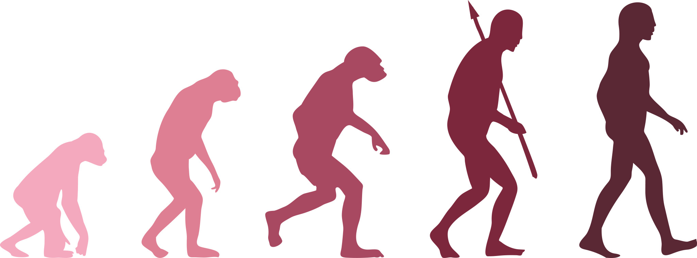

```{r setup, include=FALSE}
options(htmltools.dir.version = FALSE)
knitr::opts_chunk$set(
  fig.width=9, fig.height=3.5, fig.retina=3,
  out.width = "100%",
  cache = FALSE,
  echo = TRUE,
  message = FALSE, 
  warning = FALSE,
  fig.show = TRUE,
  hiline = TRUE
)
```

```{r xaringan-themer, include=FALSE, warning=FALSE}
library(xaringanthemer)
style_mono_accent(
  base_color = "#990000", 
  header_font_google = google_font("Lora"),
  text_font_google   = google_font("Montserrat", "300", "300i"),
  code_font_google   = google_font("Fira Mono")
)
```

name:evolut

# Evolutionary Algorithms (EA)

- Used for optimisation

- EA are dynamic and can evolve over time

- Main characteristics:
  - Population based
  - Fitness orientated
  - Variation driven
  
<center></center>

<!--  -->

---

name:ga

# Genetic Algorithms (GA)

.pull-left[
- John Henry Holland invented the GA algorithm in the 1970s

- Random-based classical evolutionary algorithm

- Very simple compared to other EA

- Based on Theory of Evolution

- Useful when your objective function is highly complex, subject to randomness, or is discontinuous.

- Consists of:
  - **Population**
  - **Individual**
  - **Chromosome**
  - **Gene**
  - **Fitness value**
]

.pull-right[

]

---

# Genetic Algorithms

.pull-left[


]

.pull-right[


]

---

.pull-left[

# Crossover


- The best individuals generate a **mating pool** 
  - This individuals are the **parents**
  - Parents generates two offspring (**children**)
  - Higher chances to just keep good properties of the individuals and leave out bad ones
  - Desired optimal or acceptable solution
]

.pull-right[

# Mutation


- Population needs diversity
  - Apply changes to each offspring to create new individuals
  
- The set of newly generated individuals will be the new population that replaces the previously used old population

]

---
class: center, middle

# Thanks!