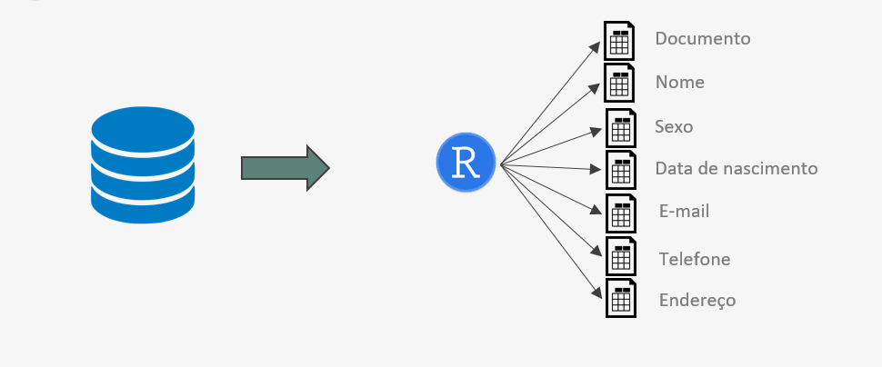

```{r setup, include=FALSE}
require(knitr)
require(kableExtra)
require(data.table)
require(magrittr)
require(dplyr)
```

## Breve histórico

- Ao entrar (como estagiário), fiquei algumas semanas estudando.
- A primeira tarefa foi o ajuste de código para automatização.
- Em seguida foi desenvolvida uma POC shiny.
- Algum tempo na análise de pesquisa de painel (em 3 ondas) e Data Fusion.
- Boa parte do período para automatização de processos (principalmente sistema de recomendação)

## Criação de pacotes

- Com o crescimento da área de Data Science, me dediquei na automatização de análises de Data Analytics.
- Responsável também por criar pacote de criação de mapas (baseado em ggplot) utilizados em entregas para alguns clientes.    
- A área me enxergou como a pessoa para desenvolver novas funcionalidades em R.

## Qualificação de dados

Um dos produtos da DTM é o Quality, que entrega a qualificação de dados cadastrais: CPF/CNPJ, limpeza e padronização de nome, atribuição de sexo (PF), validação de telefone, dentre outros pontos. O processo tinha um resultado de boa qualidade, mas era custoso e lento. A proposta foi:

- Desenvolvimento de pacote em R e Python para qualificação.
- Foco na velocidade de processamento.

## Nascimento do Qualithron

Ainda na primeira fase de testes e comparações com o Quality atual, o pacote foi batizado com a junção de Quality + R + Python: `qualithron`.



## CPF & CNPJ

- **Variáveis de entrada:** Identificação de pessoa e Documento.

- **Variáveis de saída:** Documento qualificado, tipo de pessoa (*PF*, *PJ*, *NI*), marcação de vício de preenchimento e descrição do tratamento (*válido*, *corrigido*, *inválido*, *vazio*).

- **Procedimento:** O campo de documento é tratado, caracteres não numéricos são removidos e o tamanho do campo é padronizado (14 caracteres), inserindo zeros à esquerda. O documento é, então, conduzido pela validação e identificação do tipo de pessoa.

## Nome

- **Variáveis de entrada:** Identificação de pessoa, tipo de pessoa e nome completo.

- **Variáveis de saída:** Primeiro nome, sobrenome, marcação de palavrão e descrição do tratamento.

- **Procedimento:** Primeiramente é feita uma limpeza no campo de nome, de acordo com o tipo da pessoa (física ou jurídica), além da padronização da escrita dos nomes com retirada de excesso de espaços e uso de letras maiúsculas. Todos os nomes são filtrados de forma a verificar a presença de palavras de baixo calão e, em seguida, o primeiro nome é localizado e separado do sobrenome. Por padrão, a separação em nome e sobrenome também é feita para pessoas não identificadas.

## Sexo

- **Variáveis de entrada:** Identificação de pessoa, primeiro nome e tipo de pessoa.

- **Variáveis de saída:** Sexo.

- **Procedimento:** O critério usado para definir o sexo é uma tabela de gênero e nomes construída a partir do censo de 2010, onde é dado uma lista com diversos nomes registrados no Brasil com a frequência desses nomes para cada sexo. Nomes ambíguos foram definidos segundo a seguinte regra: se pelo menos $80\%$ das pessoas com determinado nome se afirmaram de um sexo, então atribui-se este sexo ao nome. Caso contrário, o nome é tido como ambíguo. Caso a pessoa seja do tipo PJ, então é atribuído o valor Jurídico ao campo de sexo.

## Data de Nascimento

- **Variáveis de entrada:** Identificação de pessoa e data de nascimento.

- **Variáveis de saída:** Idade, validação de idade e marcação de vício de preenchimento.

- **Procedimento:** Inicialmente é calculada a idade da pessoa a partir da data de nascimento. Em seguida a idade é validada, verificando se está num intervalo (definido *a priori*) e por fim é verificado se o campo de data possui vícios de preenchimento.

## E-mail

- **Variáveis de entrada:** Identificação de pessoa e e-mail.

- **Variáveis de saída:** E-mail tratado, usuário, domínio, marcação de palavrão e descrição do tratamento.

- **Procedimento:** Realiza-se a limpeza do campo (remoção de espaços, substituição de vírgulas e ponto e vírgula por ponto, substituição de dois ou mais \@ em sequência por apenas um, reescrita do campo com letras maiúsculas). E-mails com mais de um @ em diferentes lugares são dados como inválidos. Erros comuns de digitação do domínio são corrigidos e, por fim, o e-mail é separado no @ em usuário e domínio e é verificado se há presença de palavras de baixo calão.

## Telefone

- **Variáveis de entrada:** Identificação de pessoa e telefone completo.

- **Variáveis de saída:** DDD, telefone, validação de DDD e telefone, identificação de tipo de telefone e descrição do tratamento.

- **Procedimento:** Faz a limpeza dos números, separação entre DDD e número e identificação do número como fixo ou móvel.  A validação do DDD é dada pela checagem da lista de DDD do Brasil. Já o número deve estar dentro de um intervalo determinado em norma da Anatel.

## Endereço

- **Variáveis de entrada:** Identificação de pessoa, logradouro, número, CEP e UF.

- **Variáveis de saída:** Bairro, Cidade, UF, CEP qualificado, DDD (opcional), validação de endereço e descrição do tratamento (CEP).

- **Procedimento:** Primeiramente é realizada uma padronização e limpeza do campo CEP. Para a validação do endereço é feita uma checagem nos campos de logradouro, número e CEP, além de efetuar a busca do CEP na base dos correios. A partir dessa busca, o processo identifica o bairro, município e UF. Também pode ser obtido o DDD da região.

## Qualithron vs Quality

Já na primeira versão, a comparação com a ferramenta até então utilizada apresentou os seguintes resultados:

```{r echo = F}
comp <- read.csv2("qualithron_vs_quality.csv") 
names(comp) <- gsub("\\.", " ", names(comp))

kable(comp, format = "latex", booktabs = TRUE, linesep = "") %>% 
  row_spec(0, bold = TRUE) %>% 
  kable_styling(latex_options = "scale_down")
```

A validação da idade foi inserida num outro momento.

## Performance

Na primeira versão, a base de testes, com $1,1$ milhão de registros, o pacote executou a qualificação em cerca de $8$ minutos. Por outro lado, $2,5$ milhões de registros foram qualificados em aproximadamente $30$ minutos.

Na versão atual, com todas as atualizações, o último teste, com $2,1$ milhões de registros, levou aproximadamente $17$ minutos.


```{r echo = F}
tempos <- read.csv2("tempo_atual.csv") 

kable(tempos, format = "latex", booktabs = TRUE, linesep = "") %>% 
  row_spec(c(0, 8), bold = TRUE) %>% 
  kable_styling(font_size = 8)
```

## Pacotes utilizados

O `qualithron` foi escrito em R e Python, mas o foco será em R:

- `data.table`

- `magrittr` $\heartsuit$ `%>%`

- `dplyr`

- `parallel`

- `stringr`

## Exemplo de Qualificação de telefone

Disponibilizo o código simplificado da função de validação de telefone. Seu uso:

```{r, echo=F, warning=F, message=F}
source("qualifica_tel_light.R")

teste <- data.frame(id_pessoa = 1:20,
                    telefone = c("1943925677", "(20) 2463-3099", "(11) 9873-9332",
                                 "(14) 85-8504", "(94) 4525-780k2", "(79) 3901-9808", 
                                 "(15) 9964-5178", "(37) 4714-7535", "(15) 4900965-5535",
                                 "(41) 3382-4193", "(11) 79772950", "(31) 6830-6321", 
                                 "(11) 56507084", "(51) 3460-8449", "(91) 4074-7353",
                                 "(44) 6340-7164", "(11) 5698-4418", "(31) 8951-2702", 
                                 "(43) 3495-3576", "(16) 3669-2444"))
```


```{r}
ql_tel <- qualifica_telefone(dados = teste, 
                             col_id = "id_pessoa", 
                             col_telefone = "telefone")
```

A saída:

```{r echo = F}
kable(head(ql_tel), format = "latex", booktabs = TRUE, linesep = "") %>% 
  row_spec(0, bold = TRUE) %>% 
  kable_styling(font_size = 5.5)

```


## Teste com dataset real

Para $3,6$ milhões de registros, o tempo de execução foi de $50$ segundos.

```{r echo = F}
tipo_tel <- read.csv2("Tipo_tel.csv") 
names(tipo_tel) <- c("Tipo de Telefone", "%")

kable(tipo_tel, format = "latex", booktabs = TRUE, linesep = "") %>% 
  row_spec(0, bold = TRUE) %>% 
  kable_styling(font_size = 8)
```


Mais de $2,3$ milhões de telefones ($63,5\%$) foram validados e pouco mais de $1,3$ milhão ($36,5\%$), invalidados.

## Conclusão

- O pacote surpreendeu todas as expectativas.

- Código simples, mas com resultados muito satisfatórios.

- O `qualithron` é usado em grandes varejistas.

- Constantemente melhorias são feitas e novas funcionalidades são adicionadas.

